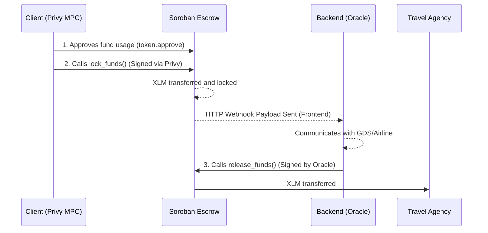

# Bit Travels — Soroban Escrow

This document summarizes the architecture, implementation, and flow of the Escrow smart contract developed for the Bit Travels platform on the Stellar network (Soroban).

---

## 1. Overview

The **Bit Travels Escrow Contract** is a smart contract written in Rust using the `soroban-sdk`. It acts as a trustless intermediary (escrow) in the ticket purchasing process, ensuring a secure, programmable settlement between the **client** and the **travel agency**.

The contract retains the funds (currently configured to use Native XLM via the Stellar Asset Contract - SAC) until the ticket issuance is confirmed by the Bit Travels backend (the "Oracle").

---

## 2. Architecture and Flow



### Key Participants
- **Client (`buyer`)**: The traveler purchasing the ticket. They sign the transaction via the Privy embedded wallet to lock the funds.
- **Oracle (`oracle`)**: The Bit Travels backend service. It is authorized by the contract to trigger the release of funds once the real-world service is fulfilled.
- **Agency (`agency`)**: The final recipient of the funds after the ticket is successfully issued.

---

## 3. Core Functions

The contract exposes two primary state-mutating functions:

### `lock_funds`
Locks a specific amount of tokens from the buyer into the contract.

**Parameters:**
- `env`: The execution environment.
- `booking_id` (String): A unique identifier for the reservation.
- `buyer` (Address): The Stellar address of the client.
- `amount` (i128): The amount of tokens to lock (in stroops).

**Process:**
1. Verifies the buyer's cryptographic signature (`buyer.require_auth()`).
2. Checks if the `booking_id` is already locked to prevent duplicates.
3. Transfers the tokens from the `buyer` to the contract itself using the Token Client.
4. Stores the escrow state (`EscrowRecord`) tied to the `booking_id`.

### `release_funds`
Releases the previously locked funds to the predefined travel agency.

**Parameters:**
- `env`: The execution environment.
- `booking_id` (String): The unique identifier of the reservation to settle.

**Process:**
1. Verifies the Oracle's cryptographic signature (`oracle.require_auth()`).
2. Retrieves the `EscrowRecord` for the given `booking_id`.
3. Verifies that the funds have not already been released.
4. Transfers the tokens from the contract to the `agency`.
5. Updates the state to mark the reservation as released, preventing double-spending.

---

## 4. Contract Initialization

Before the contract can be used, it must be initialized exactly once. This sets up the immutable configuration parameters.

### `initialize`
**Parameters:**
- `oracle` (Address): The address authorized to release funds.
- `agency` (Address): The destination address for the funds.
- `token` (Address): The address of the Token Contract (SAC). For this project, we utilize the Native XLM SAC.

---

## 5. Security Measures

- **Authentication (`require_auth`)**: Every sensitive action requires explicit cryptographic authorization from the appropriate party. The buyer must authorize locking, and the oracle must authorize releasing.
- **State Protection**: The contract verifies state transitions (e.g., ensuring a booking isn't locked twice or released twice).
- **Non-Custodial Design**: The backend/Oracle never has direct access to the user's funds. It only has the authority to release them to the hardcoded agency address.

---

## 6. Deployment (Testnet)

To deploy or upgrade the contract on the Stellar Testnet:

1. Compile the Rust code to WASM:
   ```bash
   stellar contract build
   ```
2. Deploy to the network:
   ```bash
   stellar contract deploy \
     --wasm target/wasm32-unknown-unknown/release/soroban_escrow.wasm \
     --source <DEPLOYER_SECRET> \
     --network testnet
   ```
3. Initialize the contract using `stellar contract invoke`.
