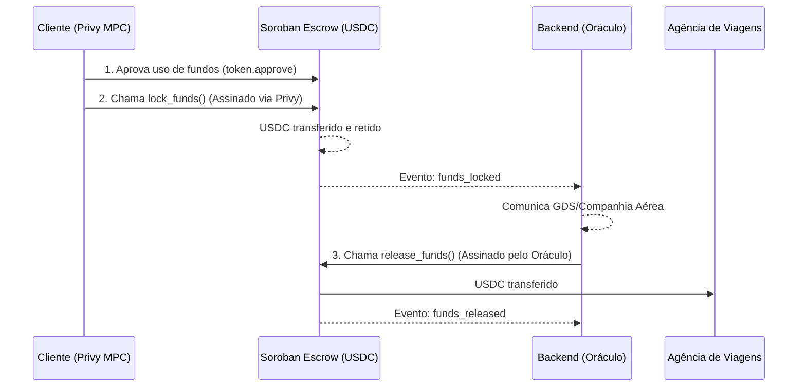

# Bit Travels — Soroban Escrow

Este documento resume a arquitetura, implementação e fluxo do contrato inteligente de Escrow desenvolvido para a plataforma Bit Travels na rede Stellar (Soroban).

---

## 1. Visão Geral

O **Bit Travels Escrow Contract** é um contrato inteligente (smart contract) escrito em Rust usando o `soroban-sdk`. Ele atua como um intermediário de confiança (escrow) no processo de compra de passagens, garantindo a liquidação programável e segura entre o **cliente** e a **agência de viagens**.

O contrato retém os fundos (em USDC ou outra stablecoin suportada pelo Stellar Asset Contract - SAC) até que a emissão da passagem seja confirmada pelo backend da Bit Travels (o "Oráculo").

---

## 2. Arquitetura e Fluxo

---

## 3. Características do Contrato (`soroban-escrow/src/lib.rs`)

### Tipo `Reservation` (Estado)
Armazena os dados persistentes de cada reserva, associados a um `booking_id` único (Symbol):
- `client`: `Address` (Endereço Stellar do cliente gerado via Privy).
- `amount`: `i128` (Valor em stroops, 7 casas decimais para USDC).
- `is_locked`: `bool` (Verdadeiro após `lock_funds`).
- `is_released`: `bool` (Verdadeiro após `release_funds`).
- `is_refunded`: `bool` (Verdadeiro após `refund`).

### Funções Principais

1. **`__constructor(env, oracle, token)`**
   - Executada apenas **uma vez** no momento do deploy (padrão Protocol 22).
   - Define o endereço do Oráculo (o backend da Bit Travels) e o token aceito (ex: contrato SAC do USDC).
   - Estes valores ficam armazenados no estado da instância (`Instance Storage`), não podendo ser alterados.

2. **`lock_funds(env, booking_id, client, amount)`**
   - **Autorização:** Exige a assinatura do **cliente** (`client.require_auth()`), garantida no frontend via Privy MPC. Ninguém pode travar fundos de terceiros.
   - Puxa os fundos do cliente para o contrato usando a interface padrão de Token do Soroban (`token.transfer`).
   - Salva o estado da reserva (`Persistent Storage`) com um TTL estendido (aprox. 30 dias) para evitar arquivamento durante o fluxo da viagem.
   - Emite o evento `funds_locked`.

3. **`release_funds(env, booking_id, agency)`**
   - **Autorização:** Exige a assinatura exclusiva do **Oráculo** (`oracle.require_auth()`). Apenas o backend oficial da Bit Travels pode liberar os fundos após confirmar a emissão do bilhete (e-ticket).
   - Transfere o valor do contrato para a conta da agência recebedora.
   - Emite o evento `funds_released`.
   - Possui proteções contra "dupla liberação" (double-release) e liberação de reservas já reembolsadas.

4. **`refund(env, booking_id)`**
   - **Autorização:** Exige a assinatura do **cliente** (`client.require_auth()`). O Oráculo não pode roubar fundos chamando refund.
   - Mecanismo de resolução de disputas: caso a passagem não seja emitida e o Oráculo nunca chame `release_funds`, o cliente pode solicitar o estorno do valor de volta para sua carteira.
   - Emite o evento `funds_refunded`.

### View Functions (Somente Leitura)
- **`get_reservation(env, booking_id)`**: Retorna o estado completo da reserva.
- **`get_oracle(env)`**: Retorna o endereço do oráculo configurado.
- **`get_token(env)`**: Retorna o endereço do token configurado.

---

## 4. Pilares de Segurança

- **Separação de Privilégios:** O Oráculo libera (`release`), mas o Cliente trava (`lock`) e reembolsa (`refund`). Nenhuma das partes pode executar a ação da outra unilateralmente de forma maliciosa.
- **Imutabilidade de Configuração:** O Oráculo e o Token são definidos em tempo de deploy no construtor. Não há portas giratórias ou chaves de administrador que possam alterá-los posteriormente.
- **Proteção contra Reentrância e Race Conditions:** Os estados booleanos (`is_released`, `is_refunded`, `is_locked`) e a checagem no `Persistent Storage` previnem que `lock_funds`, `release_funds` ou `refund` sejam chamados mais de uma vez para o mesmo ID.
- **Isolamento de Chaves:** O backend (`oracle`) usa uma secret key que nunca é exposta. O cliente assina transações na web via Privy MPC (o backend não conhece a chave do cliente).

---

## 5. Estrutura do Projeto Soroban

A pasta `soroban-escrow/` contém:
- **`Cargo.toml`**: Configurado com `soroban-sdk = "22.0.6"` e otimizações de release para diminuir o tamanho do WASM (`opt-level = "z"`, `strip = "symbols"`), mantendo a checagem de overflow ativa para segurança.
- **`src/lib.rs`**: O código completo do contrato inteligente, os tipos, os erros customizados (`EscrowError`) e 8 testes unitários que cobrem 100% dos caminhos felizes e todos os caminhos de erro esperados.
- **`README.md`**: Instruções passo-a-passo para build (`stellar contract build`), deploy para a Testnet (`stellar contract deploy`) via CLI e documentação para interações manuais (`stellar contract invoke`).

### Deploy na Testnet

O contrato foi compilado (utilizando o toolchain GNU Rust para evitar dependências MSVC) e feito o deploy com sucesso na rede Stellar Testnet:
- **Contract ID:** `CAA7ONVD3TNCRNBIOQXPJWGJIWCKWSNG5XX7FZEYA6R6V4CWP3G7XCYF`
- **Wasm Hash:** `f5f20f5a4bfea19be66b48baecada7fea9b1988a66fb8413781bec53b6450cc9`

O Oráculo e a conta da agência (para fins de teste) também foram gerados e configurados no backend.

---

## 6. Integração Frontend (Web3)

A interface se comunica com o contrato Soroban através do hook customizado **`useEscrow`** (`frontend/hooks/useEscrow.ts`). 

### Dependências e Ferramentas
- `@stellar/stellar-sdk`: Utilizado para construção do XDR da transação (`TransactionBuilder`), empacotamento dos argumentos no formato `ScVal` e comunicação com o nó RPC.
- `@privy-io/react-auth`: Provedor de Embedded Wallets baseado em MPC. Responsável por armazenar as chaves de forma não-custodial e fornecer o método `user.signTransaction`.

### Ciclo de Vida do Pagamento (Frontend)
Para garantir maior flexibilidade com o SAC (Stellar Asset Contract) e suporte a carteiras modulares, a operação do cliente é dividida em dois passos transacionais, estritamente sequenciais e validados:

1. **Passo 1 — Autorização (Approve):**
   - O `useEscrow` calcula a expiração (`expirationLedger = sequence + 1000`) e invoca a função `approve` do contrato inteligente do Token (USDC).
   - Isso concede permissão temporária (allowance) ao Escrow para reter os fundos do cliente.
   - O usuário assina essa transação via Privy e o sistema aguarda sua confirmação em cadeia (pooling).

2. **Passo 2 — Retenção (Lock Funds):**
   - Caso a Etapa 1 obtenha sucesso na rede, o hook avança, recarregando o state (Sequence Number) da conta.
   - Uma nova chamada é montada e enviada invocando `lock_funds` dentro do contrato do Escrow.
   - O usuário assina a retenção final.

3. **Confirmação Backend:**
   - Apenas com as duas etapas confirmadas na rede Soroban, o hook notifica o webhook do servidor (`/api/receive-reservation`) para registrar a reserva oficialmente.

---

## 7. Integração Backend (Oráculo)

O backend atua como o **Oráculo** do sistema. Ele é responsável por sinalizar ao contrato que a passagem foi devidamente emitida e liberar os fundos para a agência. A lógica está isolada em `backend/src/services/soroban.ts`.

### Fluxo do Oráculo
1. **Gatilho Operacional:** A agência emite o bilhete. Um admin ou sistema automatizado dispara um POST para a nova rota `/api/bookings/confirm/:bookingId`.
2. **Serviço de Assinatura:** O serviço `releaseFundsToAgency(bookingId)` é acionado. Ele utiliza a `ORACLE_SECRET_KEY` configurada no ambiente para criar um Keypair nativo do `stellar-sdk`.
3. **Simulação & Assinatura:**
   - Prepara a chamada para `release_funds(bookingId, agencyAddress)`.
   - Realiza a **Simulação RPC** obrigatória do Soroban para calcular recursos/custos exatos.
   - Monta e assina a transação localmente e com total sigilo usando a chave privada da empresa.
4. **Submissão & Conclusão:** O backend submete a XDR na rede (Testnet/Mainnet), realiza o pooling aguardando o processamento do Ledger e, após `SUCCESS`, responde a requisição original com o `txHash`. O contrato Soroban encerra o ciclo transferindo o USDC para a agência.
